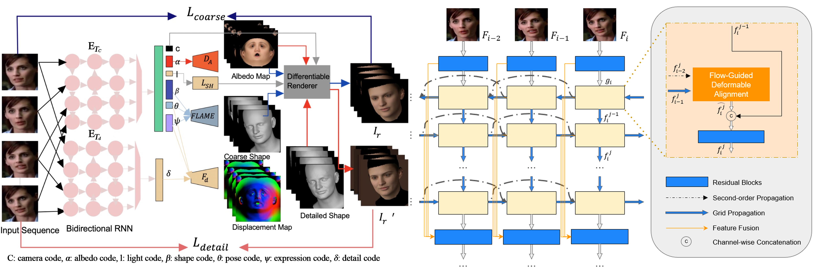
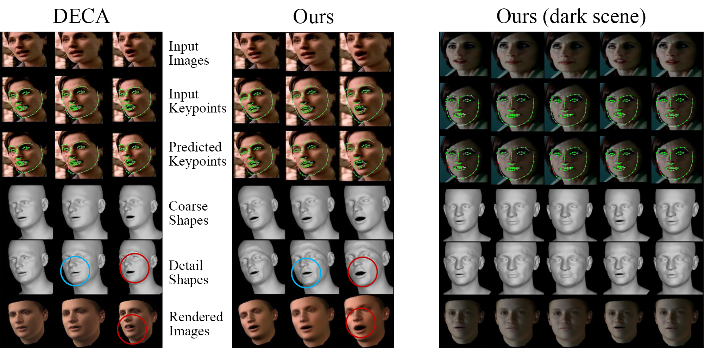

# Learning-to-Reconstruct-3D-Faces-by-Watching-TV
3D Vision course project at ETH Zürich by Mengya Liu, Jiezhang Cao, Tianhao Li, and Xiyi Chen. We utilize temporal information in videos to reconstruct high-fidelity 3D face mesh with detailed person-specific expressions.

<p align="center"> 

</p>
<p>(Left) Our network architecture. Modified based on DECA, we replace DECA’s encoders with temporal encoders to encode temporal information from video sequences. (Right) Details of our bidirectional-RNN temporal feature extractors with second-order grid propagation and flow-guided deformable alignment, modified based on BasicVSR++.<p>

Most 3D face reconstruction methods have limited abilities to capture fine-scale details. Seeking to produce more accurate person-specific details, DECA produces UV
displacement map, which contains parameters on both person-specific details and generic expressions, from lowdimensional latent codes regressed from input images. Although it demonstrates state-of-the-art performance on benchmark datasets, computational efficiency, and robustness to occlusions, it could still suffer from the severe ambiguity and ill-posedness of in-the-wild images. **In this work, we propose to use the abundant information across frames from TV series videos. We collect a sequential face dataset of subjects with continuous movements. We modify DECA and include bidirectional RNN based temporal feature extractors to propagate and aggregate temporal inforamtion across frames. Qualitative evaluation results show that our method captures more details in facial expressions compared to DECA. You can find our report [here](https://github.com/xiaoxiaokongxi/Learning-to-Reconstruct-3D-Faces-by-Watching-TV/blob/main/Learning_to_Reconstruct_3D_Faces_by_Watching_TV.pdf).**

This implementation is modified based on [DECA](https://github.com/YadiraF/DECA) and [BasicVSR++](https://github.com/ckkelvinchan/BasicVSR_PlusPlus).
  
## Getting Started
Clone the repo:
  ```bash
  git clone [https://github.com/YadiraF/DECA](https://github.com/xiaoxiaokongxi/Learning-to-Reconstruct-3D-Faces-by-Watching-TV)
  cd Learning-to-Reconstruct-3D-Faces-by-Watching-TV
  ```  

### Requirements
* Python 3.7 (numpy, skimage, scipy, opencv)  
* PyTorch >= 1.6 (pytorch3d)  
* face-alignment (Optional for detecting face)  
  You can run 
  ```bash
  pip install -r requirements.txt
  ```
  Or use virtual environment by runing 
  ```bash
  bash install_conda.sh
  ```
  For visualization, we use our rasterizer that uses pytorch JIT Compiling Extensions. If there occurs a compiling error, you can install [pytorch3d](https://github.com/facebookresearch/pytorch3d/blob/master/INSTALL.md) instead and set --rasterizer_type=pytorch3d when running the demos.

### Usage
1. Prepare data   
    a. download [FLAME model](https://flame.is.tue.mpg.de/download.php), choose **FLAME 2020** and unzip it, copy 'generic_model.pkl' into ./data  
    b. download [DECA trained model](https://drive.google.com/file/d/1rp8kdyLPvErw2dTmqtjISRVvQLj6Yzje/view?usp=sharing), and put it in ./data (**no unzip required**)  
    c. (Optional) follow the instructions for the [Albedo model](https://github.com/TimoBolkart/BFM_to_FLAME) to get 'FLAME_albedo_from_BFM.npz', put it into ./data

2. Run reconstruction demo 
```bash
python demos/demo_reconstruct.py -i TestSamples/examples --saveDepth True --saveObj True
```   
to visualize the predicted 2D landmanks, 3D landmarks (red means non-visible points), coarse geometry, detailed geometry, and depth.   
<p align="center">   

</p>

Please run `python demos/demo_reconstruct.py --help` for more details. 

We provide a sequence of 5 faces with detected keypoints and segmentation mask [here](https://github.com/xiaoxiaokongxi/Learning-to-Reconstruct-3D-Faces-by-Watching-TV/tree/main/TestSamples/TV_series/id1). For more details of the evaluation, please check our report. 

## Training
1. Prepare Training Data

    a. Download image data  
    In DECA, we use [VGGFace2](https://arxiv.org/pdf/1710.08092.pdf), [BUPT-Balancedface](http://www.whdeng.cn/RFW/Trainingdataste.html) and [VoxCeleb2](https://www.robots.ox.ac.uk/~vgg/data/voxceleb/vox2.html)  

    b. Prepare label  
    [FAN](https://github.com/1adrianb/2D-and-3D-face-alignment) to predict 68 2D landmark  
    [face-parsing]([https://github.com/YuvalNirkin/face_segmentation](https://github.com/xiyichen/face-parsing.PyTorch)) to get skin mask  
    Check out [preprocess.py](https://github.com/xiaoxiaokongxi/Learning-to-Reconstruct-3D-Faces-by-Watching-TV/blob/main/preprocess.py) fo how we prrprocess our data.

    c. Modify dataloader   
    Dataloaders for different datasets are in decalib/datasets, use the right path for prepared images and labels. 

2. Download pre-trained model  
    a. We use the model from [VGGFace2-pytorch](https://github.com/cydonia999/VGGFace2-pytorch) for calculating identity loss and put it into ./data
    b. Download [face segmentation pretrained model](https://drive.google.com/open?id=154JgKpzCPW82qINcVieuPH3fZ2e0P812) and specify the model path when using the face segmentation tool
    c. Download [SPyNet pretrained model](https://download.openmmlab.com/mmediting/restorers/basicvsr/spynet_20210409-c6c1bd09.pth) and specify its path in resnet.py, which we will use to compute optical flows in our temporal feature extractor.

3. Start training

    Train from scratch: 
    ```bash
    python main_train.py --cfg configs/release_version/deca_pretrain.yml 
    python main_train.py --cfg configs/release_version/deca_coarse.yml 
    python main_train.py --cfg configs/release_version/deca_detail.yml 
    ```
    In the yml files, write the right path for 'output_dir' and 'pretrained_modelpath'.  
    You can also use [released model](https://drive.google.com/file/d/1rp8kdyLPvErw2dTmqtjISRVvQLj6Yzje/view) as pretrained model, then ignore the pretrain step.

## Citation
If you find our work useful to your research, please cite the 2 works that it builds on:
```
@inproceedings{DECA:Siggraph2021,
  title={Learning an Animatable Detailed {3D} Face Model from In-The-Wild Images},
  author={Feng, Yao and Feng, Haiwen and Black, Michael J. and Bolkart, Timo},
  journal = {ACM Transactions on Graphics, (Proc. SIGGRAPH)}, 
  volume = {40}, 
  number = {8}, 
  year = {2021}, 
  url = {https://doi.org/10.1145/3450626.3459936} 
}

@inproceedings{chan2022basicvsrpp,
  author = {Chan, Kelvin C.K. and Zhou, Shangchen and Xu, Xiangyu and Loy, Chen Change},
  title = {{BasicVSR++}: Improving video super-resolution with enhanced propagation and alignment},
  booktitle = {IEEE Conference on Computer Vision and Pattern Recognition},
  year = {2022}
}
```
